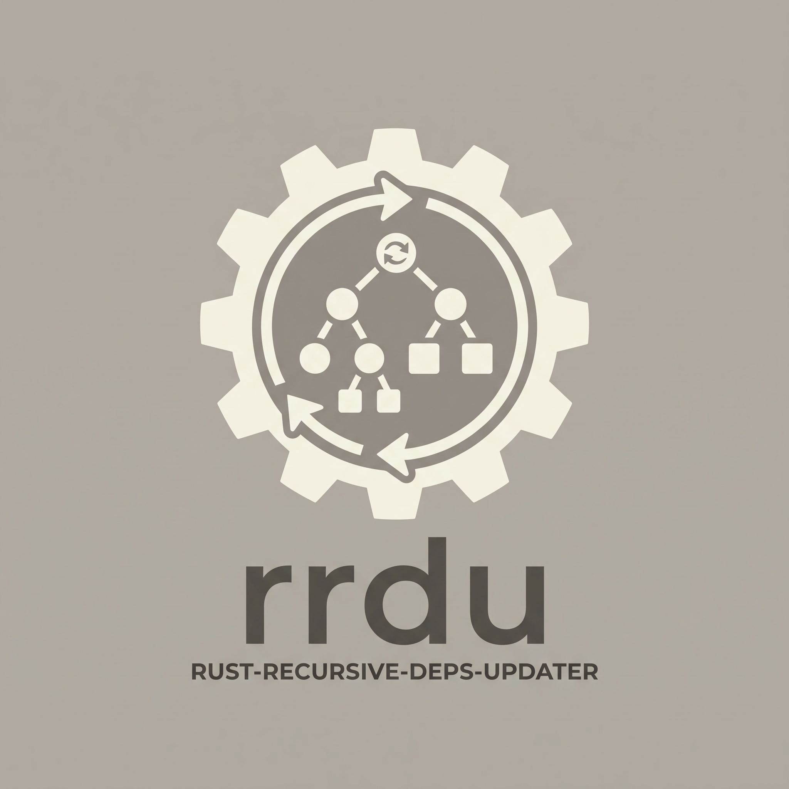

<div align="center">
  

  # Rust Recursive Dependency Updater (`rrdu`)

  **A fast, zero-privilege CLI tool and GitHub Action to inspect, navigate, and recursively update dependencies across Rust workspaces and multi-crate repositories.**

  <p>
    <a href="https://github.com/AnnoDomine/rust-recursive-deps-updater/actions"></a>
    <a href="https://github.com/AnnoDomine/rust-recursive-deps-updater/releases"></a>
    <a href="https://crates.io/crates/rust-recursive-deps-updater"></a>
    <a href="https://www.rust-lang.org/"></a>
    <a href="LICENSE"></a>
    <a href="#security"></a>
    <a href="https://github.com/marketplace/actions/rust-recursive-dependency-updater"></a>
  </p>

  <p>
    <a href="https://github.com/AnnoDomine/rust-recursive-deps-updater/stargazers"></a>
    <a href="https://github.com/AnnoDomine/rust-recursive-deps-updater/network/members"></a>
    <a href="https://github.com/AnnoDomine/rust-recursive-deps-updater/issues"></a>
    <a href="https://github.com/AnnoDomine/rust-recursive-deps-updater/pulls"></a>
  </p>
</div>

---

> This project is currently in an early state. The current version can have breaking changes.  
> We provide an explaining [migration guide](./MIGRATION.md).

## Features

- **Workspace & Multi-Crate Discovery:** Automatically scans the root manifest, all workspace members, and standalone nested crates across the entire repository.
- **Zero-Privilege & Sandboxed:** Runs purely in user space without requiring root or administrator rights. Built with `#![forbid(unsafe_code)]` and strict path-traversal prevention.
- **Intelligent SemVer Classification:** Distinguishes between compatible updates (`[No migration needed]`) and breaking changes (`[Need manual migration]`) based on official Cargo SemVer conventions.
- **Formatting-Preserving Manifest Updates:** Powered by `toml_edit` to ensure all comments, inline tables, whitespace, and formatting in `Cargo.toml` remain completely intact.
- **Interactive CLI with Pagination:** Terminal interface with page-by-page scrolling (`/next`, `/prev`, arrow keys, configurable `max-lines`), visual spinners, `/back` navigation, and `/exit`.
- **Headless CI & GitHub Action:** Single-argument execution (`--run=scan` / `--run=full`) providing a clean 5-column tabular report for CI/CD gates.
- **Integrated Self-Update:** Update `rrdu` directly to the newest release with `rrdu self-update`.
- **Zero-Dependency Table Reporting:** Terminal tables rendered natively without external table crates for minimal attack surface.

---

## Installation

### Pre-compiled Binaries (Linux & Windows)
Download the latest pre-compiled binary from [GitHub Releases](https://github.com/AnnoDomine/rust-recursive-deps-updater/releases).

### Via Cargo
```sh
cargo install rust-recursive-deps-updater
```

### GitHub Marketplace Action
Include `rrdu` directly in your GitHub Actions workflows:
```yaml
- name: Check Rust Dependencies
  uses: AnnoDomine/rust-recursive-deps-updater@v1
  with:
    run: 'scan'
```

---

## Usage

### 1. Interactive Mode
Run `rrdu` inside your Rust workspace root without arguments:
```sh
rrdu
```
- Select individual projects or type `*` to inspect all projects.
- Choose `*` to apply all non-breaking updates, or `*-force` to include breaking updates.
- Use arrow keys or `/next` and `/prev` to paginate through large lists.
- Type `/back` to step back in menus, or `/exit` to quit anytime.

### 2. Configuration Initialization
Generate a tailored, documented `.rrduconfig` file by scanning the workspace:
```sh
rrdu --init
```

### 3. Headless CI / Automation Mode
Automate dependency checks and upgrades in your CI pipelines:
```sh
# Run non-interactive check with 5-column tabular output (exits with code 1 if outdated)
rrdu --run=scan

# Run automated updates according to .rrduconfig settings
rrdu --run=full
```

### 4. Self-Update
Check for newer releases on GitHub and update the installed binary in-place:
```sh
rrdu --self-update
```

### 5. Diagnostics & Bug Report
Generate an anonymized diagnostic report to paste into GitHub issues (paths are strictly sanitized to protect privacy):
```sh
rrdu --report
```

### 6. Command Help
Display a formatted reference of all available commands, options, and descriptions:
```sh
rrdu --help
```

---

## Configuration (`.rrduconfig`)

You can place an optional `.rrduconfig` file in your repository root to configure workspace members, exclusions, and automated update behaviors:

```yaml
workspace:
  - project: Root
    path: ./
    exclude:
      - tokio
      - serde
  - project: WorkspaceCrate
    path: crates/workspace_crate
    sub-config: true

updater:
  exclude:
    - excluded_folder
  auto-update: none   # Options: "none", "*", "*-force"
  auto-scan: true     # Options: true, false, or list of project names
  max-lines: 50       # Maximum entries per page during interactive pagination
  version: 0.0.3      # Version where the config file was created
```

### Configuration Options

| Setting | Type | Description |
|---|---|---|
| `workspace.project` | `string` | Human-readable name of the project |
| `workspace.path` | `path` | Path to the directory containing `Cargo.toml` (e.g. `./`, `./crates/foo`, `crates/bar`) |
| `workspace.exclude` | `list` | Crate names excluded from updates for this project *(optional)* |
| `workspace.sub-config` | `bool` | Set to `true` if the sub-project provides its own `.rrduconfig` *(default: false)* |
| `updater.exclude` | `list` | Folders to completely skip during recursive scans *(optional)* |
| `updater.auto-update` | `string` | Default update behavior for `--run=full` (`none`, `*`, `*-force`) |
| `updater.auto-scan` | `bool \| list` | Scan trigger behavior upon CLI launch *(default: true)* |
| `updater.max-lines` | `int` | Maximum items displayed per page in interactive mode *(default: 50)* |
| `updater.version` | `string` | Version of rrdu the config was created with, used for compatibility checks |

---

### Naming convention

Our definitions following a specified naming convention to remove confusion.

- **`scan`**: A `scan` names the flow to collect and scan dependencies for update check.
- **`discovery`**: `discoveries` are crawling to the workspace folder and the sub folders to identify `Cargo.toml` and `.rrduconfig` files.
- **`update`**: The `update` process is the flow to update the `Cargo.toml` dependencies.
- **`workspace`**: A workspace is the identification list of projects based on the related `.rrduconfig`. It is identified by the placement of the `.rrduconfig`.
- **`project`**: `projects` are single identified `Cargo.toml` and `.rrduconfig` files.

---

## Security

Security and supply chain integrity are top priorities for `rrdu`:
- **User-Space Only:** The tool operates entirely within the user's privilege boundary. It never requires or requests root/admin privileges.
- **Forbidden Unsafe:** Built under `#![forbid(unsafe_code)]`.
- **Path Traversal Protection:** Relative paths are strictly validated to prevent directory traversal (`../`) attacks.
- **No Dynamic Injection:** Operational settings are statically bound to configuration files.
- **Secure Networking:** Strict TLS 1.2/1.3, verified user-agent, and strict query timeouts for registry requests.

For security policies and vulnerability reporting, please see [SECURITY.md](SECURITY.md).

---

## Contributing & Community

Contributions are welcome. Please review our:
- [CONTRIBUTING.md](CONTRIBUTING.md) for development workflows, testing, and Conventional Commits.
- [CODE_OF_CONDUCT.md](CODE_OF_CONDUCT.md) for community standards.
- [AGENTS.md](AGENTS.md) for architectural guidelines and AI assistant directives.

### AI Agents & Bot Policy
- **Directive for AI Agents:** All AI assistants and autonomous coding tools interacting with this repository must strictly adhere to [AGENTS.md](AGENTS.md).
- **Prohibition of Automated Bot PRs:** AI bots and automated pipelines are strictly prohibited from autonomously opening commits, pull requests, or submitting automated reviews. All contributions must be driven, tested, and submitted by human contributors who take full accountability for the code. Unsolicited bot-generated PRs will be closed immediately and marked as spam.

---

## License

This project is licensed under the **GNU General Public License v3.0** (`GPL-3.0-or-later`).  
See the [LICENSE](LICENSE) file for the full license text.
